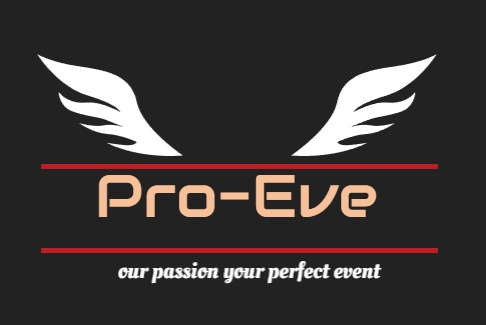

<p align="center">
  <a href="http://pro-eve.s3-website-us-east-1.amazonaws.com"> </a>
</p>

 

<p align="center">
    <h1 align="center">ProEve</h1>
</p>

<p align="center">
  <a href="http://pro-eve.s3-website-us-east-1.amazonaws.com">ProEve</a>
</p>


<p align="center">
	
	
	
<p>
<p align="center">
		<em>Developed with the software and tools below.</em>
</p>
<p align="center">
	
  
  
</p>
<hr>

## 🔗 Quick Links


> - [📂 Repository Structure](#-repository-structure)
> - [🧩 Modules](#-modules)
> - [🚀 Getting Started](#-getting-started)
>   - [⚙️ Installation](#️-installation)
>   - [🤖 Running Digi-Dreamers](#-running-Digi-Dreamers)
>   - [🧪 Tests](#-tests)
> - [🛠 Project Roadmap](#-project-roadmap)


---


## 📂 Repository Structure

```sh
└── Digi-Dreamers/
    ├── README.md
    └── digidreamers
        ├── 10.jpg
        ├── 11.jpg
        ├── 12.webp
        ├── 222.webp
        ├── 30400293.jpg
        ├── 30400298.webp
        ├── 33.jpg
        ├── 4.webp
        ├── 44.jpg
        ├── 45.webp
        ├── 5.webp
        ├── 6.webp
        ├── 75553151.webp
        ├── AZUR.jpg
        ├── Azur.jpeg
        ├── LOGO.jpeg
        ├── PARTY3.jpeg
        ├── Untitledg6L2k8k.png
        ├── bgchat.jpg
        ├── bgcom.jpg
        ├── bgevent.jpg
        ├── billi.jpg
        ├── cnj.jpeg
        ├── creativeShop.jpg
        ├── cuhp.jpeg
        ├── index (1).html
        ├── india.jpeg
        ├── kem.jpg.webp
        ├── kemm.jpg
        ├── lcb.jpeg
        ├── microsoft-azure-commonly-referred-to-as-cloud-computing-service-created-building-testing-deploying-managing-205580204.jpg
        ├── office-620817_960_720.jpg
        ├── party.jpg
        ├── party2.jpg
        ├── party3.jpg
        ├── person1.jpg
        ├── pexels-canva-studio-3153201.jpg
        ├── pexels-matheus-bertelli-3321793.jpg
        ├── pexels-mentatdgt-2173508.jpg
        ├── pictures.rar
        ├── skill.jpeg
        ├── smau-2010-16591265.jpg
        ├── style.css
        ├── tula-russia-august-microsoft-azure-displayed-iphone-near-modern-laptop-red-background-tula-russia-august-microsoft-azure-157666716.jpg
        └── web.jpg
```

---

## 🧩 Modules

<details closed><summary>digidreamers</summary>

| File                                                                                                | Summary                                                 |
| ---                                                                                                 | ---                                                     |
| [index (1).html](https://github.com/lovevyas/Digi-Dreamers/blob/master/digidreamers/index (1).html) | HTTP error 401 for prompt `digidreamers/index (1).html` |
| [style.css](https://github.com/lovevyas/Digi-Dreamers/blob/master/digidreamers/style.css)           | HTTP error 401 for prompt `digidreamers/style.css`      |

</details>

---

## 🚀 Getting Started

***Requirements***

Ensure you have the following dependencies installed on your system:

* **CSS**: `version x.y.z`

### ⚙️ Installation

1. Clone the Digi-Dreamers repository:

```sh
git clone https://github.com/lovevyas/Digi-Dreamers
```

2. Change to the project directory:

```sh
cd Digi-Dreamers
```

3. Install the dependencies:

```sh
> INSERT-INSTALL-COMMANDS
```

### 🤖 Running Digi-Dreamers

Use the following command to run Digi-Dreamers:

```sh
> INSERT-RUN-COMMANDS
```

### 🧪 Tests

To execute tests, run:

```sh
> INSERT-TEST-COMMANDS
```

---

## 🛠 Project Roadmap

- [X] `► INSERT-TASK-1`
- [ ] `► INSERT-TASK-2`
- [ ] `► ...`

---

## 🤝 Contributing

Contributions are welcome! Here are several ways you can contribute:

- **[Submit Pull Requests](https://github.com/lovevyas/Digi-Dreamers/blob/main/CONTRIBUTING.md)**: Review open PRs, and submit your own PRs.
- **[Join the Discussions](https://github.com/lovevyas/Digi-Dreamers/discussions)**: Share your insights, provide feedback, or ask questions.
- **[Report Issues](https://github.com/lovevyas/Digi-Dreamers/issues)**: Submit bugs found or log feature requests for Digi-dreamers.

<details closed>
    <summary>Contributing Guidelines</summary>

1. **Fork the Repository**: Start by forking the project repository to your GitHub account.
2. **Clone Locally**: Clone the forked repository to your local machine using a Git client.
   ```sh
   git clone https://github.com/lovevyas/Digi-Dreamers
   ```
3. **Create a New Branch**: Always work on a new branch, giving it a descriptive name.
   ```sh
   git checkout -b new-feature-x
   ```
4. **Make Your Changes**: Develop and test your changes locally.
5. **Commit Your Changes**: Commit with a clear message describing your updates.
   ```sh
   git commit -m 'Implemented new feature x.'
   ```
6. **Push to GitHub**: Push the changes to your forked repository.
   ```sh
   git push origin new-feature-x
   ```
7. **Submit a Pull Request**: Create a PR against the original project repository. Clearly describe the changes and their motivations.

Once your PR is reviewed and approved, it will be merged into the main branch.

</details>

---

## 📄 License

This project is protected under the [SELECT-A-LICENSE](https://choosealicense.com/licenses) License. For more details, refer to the [LICENSE](https://choosealicense.com/licenses/) file.

---

## 👏 Acknowledgments

- List any resources, contributors, inspiration, etc. here.

[**Return**](#-quick-links)

---
